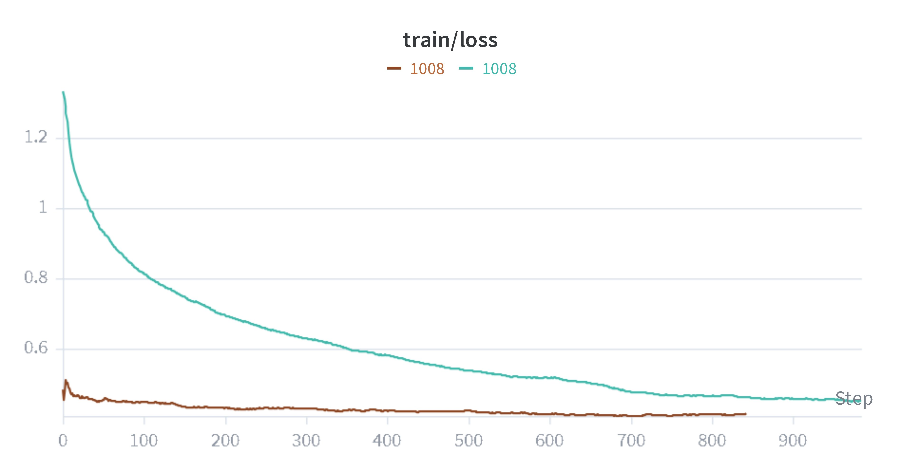
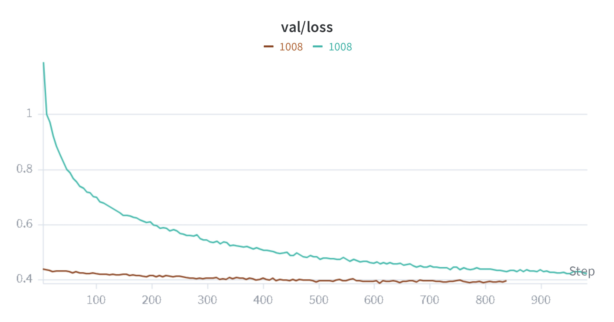

# Text Diffusion: Generating Meaning from Randomness

A project focused on teaching a system to create structured text by reversing a process of "adding noise." Instead of predicting the next word like traditional models, this approach starts with a field of random patterns and gradually refines them until clear, meaningful text emerges.

## How it Works

This project implements a **DDPM (Denoising Diffusion Probabilistic Model)** specifically tailored for text. Unlike image diffusion, which works on pixels, this system operates on the **embedding space**—a mathematical map where words with similar meanings are placed close together.

1. **Training**: We take clear text, convert it into its mathematical "embedding" form, and slowly add random static until it's just noise. The model learns to reverse this process by predicting and removing the noise at each step.
2. **Generation**: We start with pure random noise in the embedding space and use the model to "un-blur" it over 100 steps. Finally, we map these refined embeddings back into readable words to produce the final text.

## Project Visuals

### Generation Process
This video shows the model's progress as it learns to transform randomness into structured information.

<video src="checkpoints/outputs/diffusion_output - Copy.mp4" controls width="100%"></video>

### Performance Tracking
These graphs show how the system improved over time, reducing errors as it became better at identifying and reversing the noise.

| Training Improvement | Validation Consistency |
|:---:|:---:|
|  |  |

## Getting Started

### Prerequisites
- Python 3.11+
- All dependencies listed in `pyproject.toml`

### Training the Model
To start training the system from scratch or resume from the last saved state:
```bash
make train
```

### Generating Text
To use a trained model to generate new text:
```bash
make infer
```

## Project Structure

- `core/`: Basic configurations and system setup.
- `data/`: Tools for handling and preparing the text datasets.
- `diffusion/`: The logic for adding and removing "noise" from text.
- `model/`: The pattern-matching engine (Transformer-based).
- `trainer/`: The logic that guides the learning process.
- `checkpoints/`: Where the system saves its progress and generated outputs.

## Technical Details
- **Model Type**: DDPM (Denoising Diffusion Probabilistic Model).
- **Operation Space**: Continuous Embedding Space.
- **Data Source**: Wikitext (Wikipedia articles).
- **Refinement Steps**: 100 steps to turn noise into text.
- **Pattern Matcher**: A 6-layer Transformer system.
